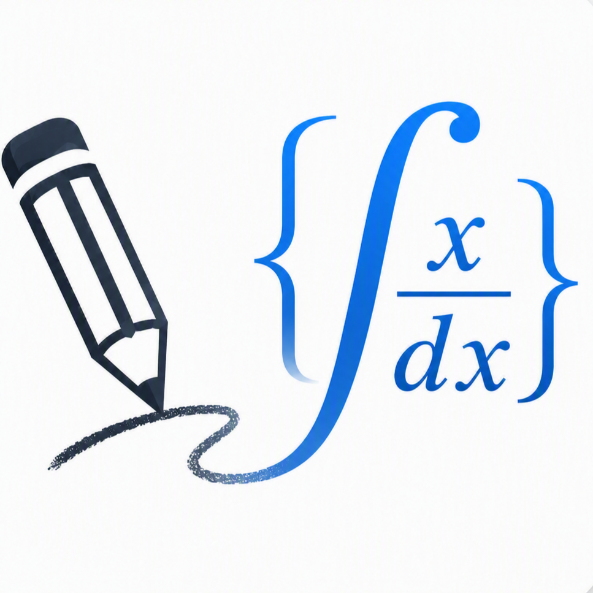

<p align="center">
  
</p>

# Sketch2LaTeX

A tool that turns visual STEM ideas into editable LaTeX and TikZ.

Sketch2LaTeX helps students and teachers draw mathematical, scientific, and engineering diagrams and convert them into editable LaTeX/TikZ code.

[Live Demo](https://sketch2latex-20260710.imouchiha3.chatgpt.site/) · [Watch the Demo Video](https://www.youtube.com/watch?v=g26Ggc5HqOU)

Built for OpenAI Build Week using Codex and GPT-5.6.

> **Development note:** The idea and initial foundation were created with GPT-5.6 and Codex when GPT-5.6 launched. Most of Sketch2LaTeX—including advanced features such as **Draw on PDF**, the **graph workspace**, and later accuracy and usability refinements—was built during the hackathon week. The entire project was developed using GPT-5.6 and Codex.

## Inspiration

STEM students often understand mathematical and scientific diagrams visually, yet turning those ideas into professional TikZ can be slow and difficult. Sketch2LaTeX makes technical drawing approachable without requiring users to master TikZ syntax first.

## What it does

Sketch2LaTeX provides two workspaces:

- **Blank Canvas** for creating diagrams from scratch.
- **Draw on PDF** for placing editable drawing objects over an already-compiled PDF.

Users can combine drawing tools, text, formulas, and reusable physics, mechanics, optics, mathematics, chemistry, and other STEM components. The result can be exported as editable TikZ/LaTeX, SVG, or PDF.

Uploaded PDFs are visual backgrounds only. PDF.js processes them locally in the browser; they are not uploaded or included in generated TikZ/LaTeX.

## Why it helps education

- Reduces the TikZ learning barrier.
- Helps students focus on scientific ideas instead of syntax.
- Helps teachers create worksheets, lessons, and technical diagrams.
- Produces editable technical output rather than static screenshots.
- Lets students work in the context of existing notes and exercises.

## Main features

- Scientific SVG drawing canvas with undo and redo.
- Reusable STEM components and searchable templates.
- Rich multiline text and visual mathematical formula editing.
- Group selection, proportional transformations, rotation, and smart connections.
- TikZ/LaTeX generation, copying, and download.
- SVG and PDF export.
- Local PDF background mode with page navigation.
- Page-specific drawing state and responsive PDF alignment.
- PDF opacity, visibility, replacement, and removal controls.
- Standard document presets, including common screen and print formats.
- Local project saving in the browser.

## Built with Codex and GPT-5.6

Codex with GPT-5.6 supported the application architecture, SVG drawing canvas, scientific component libraries, TikZ generation, geometry and coordinate synchronization, PDF.js integration, page-specific drawing persistence, testing, debugging, interface decisions, and documentation.

The application itself does not call the OpenAI API. Codex and GPT-5.6 were development tools used to build and refine the project.

## How it works

- React and TypeScript provide the interface and editor state.
- Vinext and Vite build the application for the web and Codex Sites.
- The editor represents each drawing as serializable canvas objects rendered in SVG.
- A dedicated generator converts those objects and their geometry into TikZ/LaTeX.
- PDF.js renders uploaded PDF pages locally beneath the drawing layer.
- Normalized page coordinates keep annotations aligned as the viewport changes.
- Browser-only file processing avoids a server upload workflow.

## Project structure

- `app/page.tsx` — editor interface, canvas interactions, PDF workflow, and exports.
- `app/components/` — focused interactive UI components, including the visual formula editor.
- `app/lib/` — typed geometry, templates, project persistence, PDF validation, and TikZ generation.
- `tests/` — automated checks for export fidelity, formulas, PDF state, downloads, and selection transforms.
- `worker/` and `.openai/` — Cloudflare Worker entry point and Codex Sites hosting configuration.

## Core value

Sketch2LaTeX removes the difficulty of manually writing complex TikZ code, especially for students who understand a diagram visually but struggle to reproduce it in LaTeX.

## Privacy

- Uploaded PDFs stay in the browser and are never sent to an application server.
- PDFs are not stored in a database.
- PDF content is not inserted into generated TikZ/LaTeX.
- Only drawing objects are converted into TikZ/LaTeX.

## Local installation

Requirements: Node.js 22.13.0 or newer.

```bash
npm install
npm run dev
```

Open the local URL printed by the development server.

## Production build

```bash
npm run build
```

## Tests

```bash
npm run lint
npm run test:latex
npm test
```

## Manual demo

1. Open **Blank Canvas**.
2. Create a physics or geometry diagram.
3. Generate and copy its TikZ/LaTeX.
4. Return to the project launcher and open **Draw on PDF**.
5. Upload an already-compiled PDF.
6. Draw above the first page.
7. Navigate between pages and confirm each page keeps its own drawings.
8. Export the drawing layer without embedding the source PDF in TikZ.

## Current limitations

- PDF files are session-only and are not restored after a browser refresh.
- Removing or replacing a PDF clears its page drawings after confirmation.
- Canvas pan and zoom are disabled in PDF mode to preserve exact registration; responsive fit-width scaling remains supported.
- Password-protected PDFs must be unlocked before import.
- PDF imports are limited to 100 MB to protect browser memory.
- The original PDF is not modified.
- Generated code is not inserted into the original LaTeX source.
- There is no server-side LaTeX compilation.
- The application requires no OpenAI API and has no runtime AI conversion.

## Future roadmap

- Direct `.tex` project integration.
- Optional LaTeX compilation and an Overleaf workflow.
- Diagram understanding and educational checking.
- Real-time collaboration.

These items are future work and are not part of the current application.

## Repository and hackathon evidence

The repository commit history documents the development performed during the hackathon. It preserves the progression of the editor, component system, export pipeline, PDF workflow, tests, and release preparation.

## License

MIT — see [LICENSE](LICENSE).
